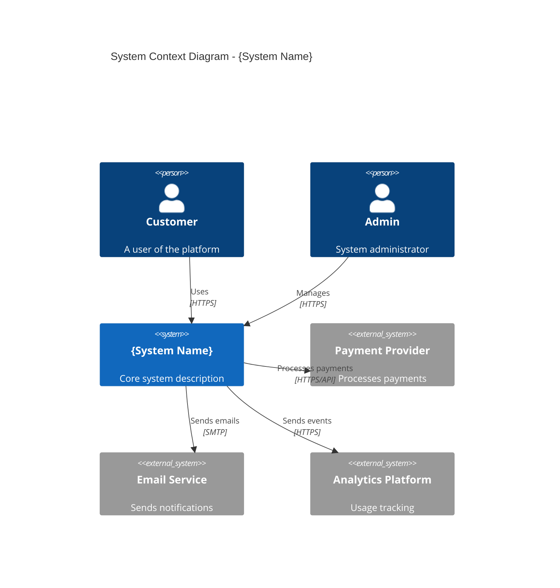
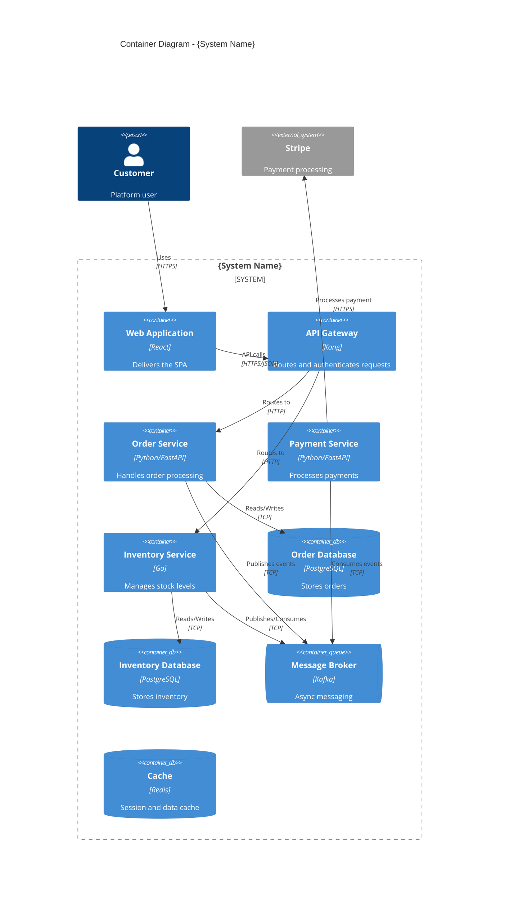
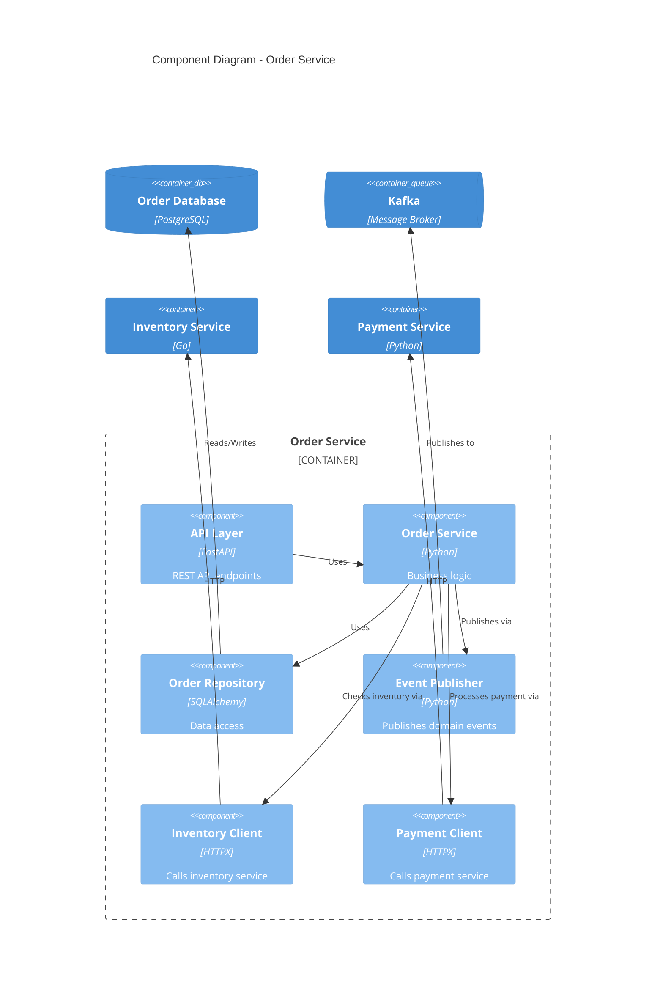
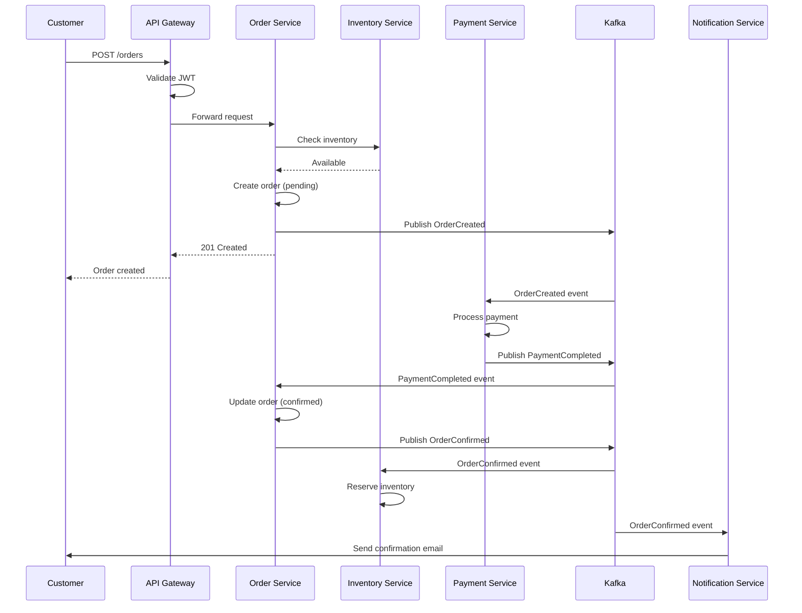
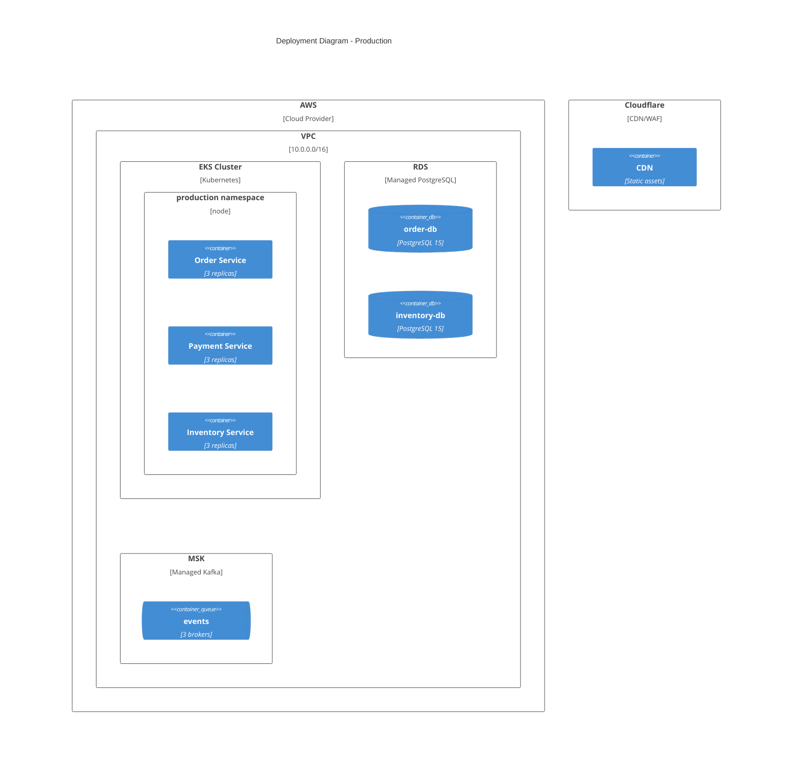

# C4 Diagram Templates

C4 model provides four levels of abstraction for visualizing software architecture.

---

## Level 1: System Context Diagram

Shows the system in scope and its relationships with users and other systems.



### Alternative (Text-based for compatibility)

```
┌─────────────────────────────────────────────────────────────────┐
│                        SYSTEM CONTEXT                           │
├─────────────────────────────────────────────────────────────────┤
│                                                                 │
│    ┌──────────┐                           ┌──────────┐         │
│    │ Customer │                           │  Admin   │         │
│    └────┬─────┘                           └────┬─────┘         │
│         │                                      │               │
│         │  Uses (HTTPS)          Manages (HTTPS)               │
│         │                                      │               │
│         └──────────────┬───────────────────────┘               │
│                        │                                       │
│                        ▼                                       │
│              ┌─────────────────┐                               │
│              │   {System}      │                               │
│              │                 │                               │
│              │  Core platform  │                               │
│              └────────┬────────┘                               │
│                       │                                        │
│         ┌─────────────┼─────────────┐                         │
│         │             │             │                          │
│         ▼             ▼             ▼                          │
│   ┌──────────┐  ┌──────────┐  ┌──────────┐                    │
│   │ Payment  │  │  Email   │  │Analytics │                    │
│   │ Provider │  │ Service  │  │ Platform │                    │
│   └──────────┘  └──────────┘  └──────────┘                    │
│   [External]    [External]    [External]                       │
│                                                                 │
└─────────────────────────────────────────────────────────────────┘
```

---

## Level 2: Container Diagram

Shows the high-level technical building blocks (containers) within the system.



### Text-based Container Diagram

```
┌─────────────────────────────────────────────────────────────────────────────┐
│                              {SYSTEM NAME}                                  │
├─────────────────────────────────────────────────────────────────────────────┤
│                                                                             │
│   [Customer]                                                                │
│       │                                                                     │
│       │ HTTPS                                                               │
│       ▼                                                                     │
│   ┌───────────────┐                                                         │
│   │ Web App       │                                                         │
│   │ [React SPA]   │                                                         │
│   └───────┬───────┘                                                         │
│           │ HTTPS/JSON                                                      │
│           ▼                                                                 │
│   ┌───────────────┐                                                         │
│   │ API Gateway   │                                                         │
│   │ [Kong]        │                                                         │
│   └───────┬───────┘                                                         │
│           │                                                                 │
│     ┌─────┴─────┬─────────────┐                                            │
│     │           │             │                                             │
│     ▼           ▼             ▼                                             │
│ ┌─────────┐ ┌─────────┐ ┌─────────┐                                        │
│ │ Order   │ │ Payment │ │Inventory│                                        │
│ │ Service │ │ Service │ │ Service │                                        │
│ │[FastAPI]│ │[FastAPI]│ │  [Go]   │                                        │
│ └────┬────┘ └────┬────┘ └────┬────┘                                        │
│      │           │           │                                              │
│      │     ┌─────┴─────┐     │                                              │
│      │     │   Kafka   │     │                                              │
│      │     │  [Broker] │◄────┤                                              │
│      │     └───────────┘     │                                              │
│      │                       │                                              │
│      ▼                       ▼                                              │
│ ┌─────────┐            ┌─────────┐                                         │
│ │Order DB │            │Inv. DB  │                                         │
│ │[Postgres]│           │[Postgres]│                                        │
│ └─────────┘            └─────────┘                                         │
│                                                                             │
└─────────────────────────────────────────────────────────────────────────────┘
```

---

## Level 3: Component Diagram

Shows the components within a single container.



### Text-based Component Diagram

```
┌─────────────────────────────────────────────────────────────────┐
│                        ORDER SERVICE                            │
├─────────────────────────────────────────────────────────────────┤
│                                                                 │
│   ┌─────────────────────────────────────────────────────────┐  │
│   │                      API Layer                          │  │
│   │                     [FastAPI]                           │  │
│   │  POST /orders  GET /orders/{id}  PUT /orders/{id}       │  │
│   └─────────────────────────┬───────────────────────────────┘  │
│                             │                                   │
│                             ▼                                   │
│   ┌─────────────────────────────────────────────────────────┐  │
│   │                    Order Service                        │  │
│   │                   [Business Logic]                      │  │
│   │                                                         │  │
│   │  create_order()  confirm_order()  cancel_order()        │  │
│   └──────┬──────────────────┬──────────────────┬────────────┘  │
│          │                  │                  │                │
│          │                  │                  │                │
│    ┌─────▼─────┐     ┌──────▼──────┐    ┌─────▼─────┐         │
│    │ Order     │     │   Event     │    │  Clients  │         │
│    │ Repository│     │  Publisher  │    │           │         │
│    │[SQLAlchemy]│    │             │    │ Inventory │         │
│    └─────┬─────┘     └──────┬──────┘    │ Payment   │         │
│          │                  │           └─────┬─────┘         │
│          │                  │                 │                │
└──────────┼──────────────────┼─────────────────┼────────────────┘
           │                  │                 │
           ▼                  ▼                 ▼
      ┌─────────┐       ┌─────────┐      ┌───────────┐
      │Order DB │       │  Kafka  │      │ External  │
      │[Postgres]│      │         │      │ Services  │
      └─────────┘       └─────────┘      └───────────┘
```

---

## Sequence Diagrams

### Order Creation Flow



### Text-based Sequence

```
Customer    API Gateway    Order Svc    Inventory    Payment    Kafka
   │             │             │            │           │          │
   │ POST /orders│             │            │           │          │
   │────────────>│             │            │           │          │
   │             │ Validate JWT│            │           │          │
   │             │─────────────│            │           │          │
   │             │             │            │           │          │
   │             │ Forward     │            │           │          │
   │             │────────────>│            │           │          │
   │             │             │            │           │          │
   │             │             │ Check stock│           │          │
   │             │             │───────────>│           │          │
   │             │             │<───────────│           │          │
   │             │             │ Available  │           │          │
   │             │             │            │           │          │
   │             │             │ Create order           │          │
   │             │             │────────────────────────────────>  │
   │             │             │            │           │ OrderCreated
   │             │<────────────│            │           │          │
   │<────────────│ 201 Created │            │           │          │
   │             │             │            │           │          │
   │             │             │            │           │<─────────│
   │             │             │            │           │ Process  │
   │             │             │            │           │──────────>
   │             │             │            │           │ PaymentCompleted
   │             │             │<──────────────────────────────────│
   │             │             │ Update status          │          │
   │             │             │────────────────────────────────>  │
   │             │             │            │           │ OrderConfirmed
```

---

## Deployment Diagram



### Text-based Deployment

```
┌─────────────────────────────────────────────────────────────────────────────┐
│                              AWS CLOUD                                      │
├─────────────────────────────────────────────────────────────────────────────┤
│                                                                             │
│  ┌─────────────────────────────────────────────────────────────────────┐   │
│  │                         VPC (10.0.0.0/16)                           │   │
│  ├─────────────────────────────────────────────────────────────────────┤   │
│  │                                                                     │   │
│  │  ┌─────────────────────────────────────────────────────────────┐   │   │
│  │  │                    EKS CLUSTER                              │   │   │
│  │  ├─────────────────────────────────────────────────────────────┤   │   │
│  │  │                                                             │   │   │
│  │  │  ┌─────────────────────────────────────────────────────┐   │   │   │
│  │  │  │              production namespace                   │   │   │   │
│  │  │  │                                                     │   │   │   │
│  │  │  │  ┌─────────┐  ┌─────────┐  ┌─────────┐            │   │   │   │
│  │  │  │  │ Order   │  │ Payment │  │Inventory│            │   │   │   │
│  │  │  │  │ Service │  │ Service │  │ Service │            │   │   │   │
│  │  │  │  │(3 pods) │  │(3 pods) │  │(3 pods) │            │   │   │   │
│  │  │  │  └─────────┘  └─────────┘  └─────────┘            │   │   │   │
│  │  │  │                                                     │   │   │   │
│  │  │  └─────────────────────────────────────────────────────┘   │   │   │
│  │  │                                                             │   │   │
│  │  └─────────────────────────────────────────────────────────────┘   │   │
│  │                                                                     │   │
│  │  ┌─────────────────────────┐  ┌─────────────────────────┐         │   │
│  │  │        RDS              │  │         MSK             │         │   │
│  │  │  ┌─────────┐           │  │  ┌─────────┐           │         │   │
│  │  │  │order-db │           │  │  │ Kafka   │           │         │   │
│  │  │  │[Primary]│           │  │  │ Cluster │           │         │   │
│  │  │  └─────────┘           │  │  │(3 nodes)│           │         │   │
│  │  │  ┌─────────┐           │  │  └─────────┘           │         │   │
│  │  │  │inv-db   │           │  │                         │         │   │
│  │  │  │[Primary]│           │  │                         │         │   │
│  │  │  └─────────┘           │  │                         │         │   │
│  │  └─────────────────────────┘  └─────────────────────────┘         │   │
│  │                                                                     │   │
│  └─────────────────────────────────────────────────────────────────────┘   │
│                                                                             │
└─────────────────────────────────────────────────────────────────────────────┘
```

---

## Usage Guidelines

1. **Start with Context (L1)**: Always begin with the big picture
2. **Zoom into Containers (L2)**: Show technical building blocks
3. **Detail Components (L3)**: Only for complex services that need explanation
4. **Code Level (L4)**: Rarely needed, usually generated from code

### When to Use Each Level

| Audience | Recommended Levels |
|----------|-------------------|
| Executives | L1 only |
| Architects | L1, L2 |
| Developers | L2, L3 |
| New team members | L1, L2, L3 |

### Diagram Maintenance

- Update diagrams when architecture changes
- Store in version control alongside code
- Generate from code where possible
- Review during architecture meetings
